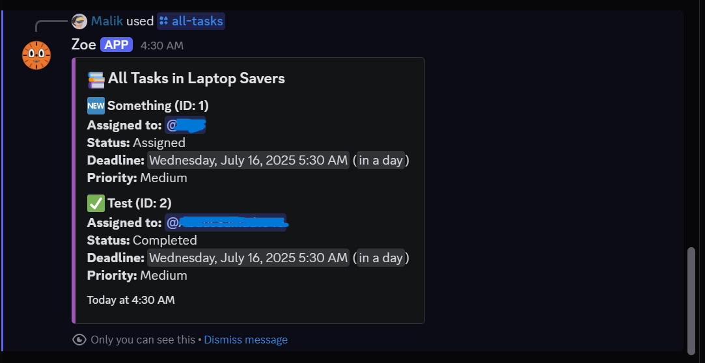

# Employee Task Management Discord Bot

A comprehensive Discord bot for managing employee tasks with automated reminders, deadline tracking, and supervisor reporting features.

## Features

### Core Functionality
- **Task Assignment**: Assign tasks to team members with deadlines and priorities
- **Automated Reminders**: Send reminders 17 hours after task assignment
- **Deadline Tracking**: Notify users when deadlines are reached
- **Status Updates**: Allow users to update task progress and status
- **Task Management**: View personal tasks and track completion

### Supervisor Features
- **Daily Summaries**: Automated daily reports with task statistics
- **Progress Tracking**: Monitor team performance and task completion
- **Escalation System**: Automatic notifications for overdue tasks
- **User Statistics**: Track karma points and performance metrics

### Advanced Features
- **Priority Levels**: Support for low, medium, high, and urgent priorities
- **Task History**: Complete audit trail of all task activities
- **Cross-timezone Support**: Configurable timezone handling
- **Database Persistence**: SQLite database for reliable data storage

---

## Screenshots

Here are some screenshots of the bot in action:


*Task assignment in Discord*


*Viewing assigned tasks*


*Automated task reminder*


*Daily summary sent to supervisor*


*Overdue task notification*


*Bot user interface example*

---

## Commands

### User Commands
- `/assign @member "Task Title" "Description" deadline: YYYY-MM-DD HH:MM [priority]`
  - Assign a task to a team member
  - Example: `/assign @john "Fix login bug" "Resolve authentication issue" deadline: 2025-07-06 16:00 priority: high`

- `/update-task <task_id> <status> [note]`
  - Update task status (assigned, in_progress, stuck, completed, cancelled)
  - Example: `/update-task 123 completed "Fixed the authentication bug"`

- `/my-tasks [status]`
  - View your assigned tasks, optionally filtered by status
  - Example: `/my-tasks in_progress`

## Setup Instructions

### Prerequisites
- Python 3.11 or higher
- Discord Bot Token
- Discord Server (Guild) ID
- Supervisor Discord User ID (optional)

### Method 1: Docker Deployment (Recommended)

1. **Clone or download the bot files**
   ```bash
   git clone <repository-url>
   cd discord-task-bot
   ```

2. **Create environment file**
   ```bash
   cp .env.example .env
   ```

3. **Configure environment variables in `.env`**
   ```env
   DISCORD_TOKEN=your_discord_bot_token_here
   GUILD_ID=your_discord_server_id_here
   SUPERVISOR_USER_ID=your_supervisor_discord_id_here
   REMINDER_HOURS=17
   DAILY_SUMMARY_TIME=21:00
   TIMEZONE=UTC
   ```

4. **Build and run with Docker Compose**
   ```bash
   docker-compose up -d
   ```

5. **Check logs**
   ```bash
   docker-compose logs -f discord-task-bot
   ```

### Method 2: Manual Installation

1. **Install Python dependencies**
   ```bash
   pip install -r requirements.txt
   ```

2. **Set up environment variables**
   ```bash
   cp .env.example .env
   # Edit .env with your configuration
   ```

3. **Create necessary directories**
   ```bash
   mkdir -p data logs
   ```

4. **Run the bot**
   ```bash
   cd src
   python bot.py
   ```

## Discord Bot Setup

### 1. Create Discord Application
1. Go to [Discord Developer Portal](https://discord.com/developers/applications)
2. Click "New Application" and give it a name
3. Go to "Bot" section and click "Add Bot"
4. Copy the bot token for your `.env` file

### 2. Configure Bot Permissions
Required permissions:
- Send Messages
- Use Slash Commands
- Read Message History
- Send Messages in Threads
- Use External Emojis
- Add Reactions

### 3. Invite Bot to Server
1. Go to "OAuth2" > "URL Generator"
2. Select "bot" and "applications.commands" scopes
3. Select the required permissions
4. Use the generated URL to invite the bot to your server

### 4. Get Server and User IDs
1. Enable Developer Mode in Discord (User Settings > Advanced > Developer Mode)
2. Right-click your server name and "Copy ID" for GUILD_ID
3. Right-click supervisor's username and "Copy ID" for SUPERVISOR_USER_ID

## Configuration

### Environment Variables

| Variable | Description | Default | Required |
|----------|-------------|---------|----------|
| `DISCORD_TOKEN` | Discord bot token | - | Yes |
| `GUILD_ID` | Discord server ID | - | Yes |
| `TASKS_CHANNEL_ID` | ID of the channel for bot notifications | - | Yes |
| `SUPERVISOR_USER_ID` | Supervisor's Discord user ID | - | No |
| `REMINDER_HOURS` | Hours after assignment to send reminder | 17 | No |
| `DAILY_SUMMARY_TIME` | Time to send daily summary (HH:MM) | 21:00 | No |
| `TIMEZONE` | Timezone for scheduling | UTC | No |
| `DATABASE_PATH` | Path to SQLite database | data/tasks.db | No |

### Timezone Configuration
Supported timezone formats:
- `UTC`
- `US/Eastern`
- `Europe/London`
- `Asia/Tokyo`
- Any valid pytz timezone

## Usage Examples

### Assigning Tasks
```
/assign @employee "Implement user authentication" "Create login/logout functionality with JWT tokens" deadline: 2025-07-10 17:00 priority: high
```

### Updating Task Status
```
/update-task 42 in_progress "Started working on the authentication module"
/update-task 42 completed "Authentication system implemented and tested"
```

### Viewing Tasks
```
/my-tasks
/my-tasks completed
/my-tasks in_progress
```

## Database Schema

### Tasks Table
- `id`: Unique task identifier
- `title`: Task title
- `description`: Detailed description
- `assigned_to_id`: Discord user ID of assignee
- `assigned_by_id`: Discord user ID of assigner
- `guild_id`: Discord server ID
- `deadline`: Task deadline (UTC)
- `status`: Current status (assigned, in_progress, stuck, completed, cancelled)
- `priority`: Priority level (low, medium, high, urgent)
- `created_at`: Creation timestamp
- `reminder_sent`: Whether reminder has been sent
- `deadline_notified`: Whether deadline notification has been sent
- `completed_at`: Completion timestamp

### Task Updates Table
- `id`: Update ID
- `task_id`: Reference to task
- `user_id`: User who made the update
- `status`: New status
- `note`: Optional note
- `created_at`: Update timestamp

### User Stats Table
- `user_id`: Discord user ID
- `guild_id`: Discord server ID
- `tasks_completed`: Number of completed tasks
- `tasks_overdue`: Number of overdue tasks
- `karma_points`: Performance points
- `last_updated`: Last update timestamp

## Automated Features

### Reminder System
- Sends reminder DM after configured hours (default: 17)
- Only sends one reminder per task
- Includes task details and deadline information

### Deadline Notifications
- Checks every 15 minutes for overdue tasks
- Sends urgent notification when deadline passes
- Updates user statistics for overdue tasks

### Daily Summaries
- Sent to supervisor at configured time (default: 21:00)
- Includes tasks assigned today, due tomorrow, and overdue
- Shows recent status updates
- Separate summary for each Discord server

## Troubleshooting

### Common Issues

1. **Bot not responding to commands**
   - Check bot permissions in Discord server
   - Verify bot token is correct
   - Ensure slash commands are synced

2. **Database errors**
   - Check file permissions for data directory
   - Ensure SQLite is properly installed
   - Verify database path in configuration

3. **Timezone issues**
   - Use valid pytz timezone names
   - Check system timezone if using local time
   - Verify DAILY_SUMMARY_TIME format (HH:MM)

4. **Reminders not working**
   - Check bot logs for errors
   - Verify users can receive DMs from the bot
   - Ensure background tasks are running

### Logs
- Application logs: `logs/bot.log`
- Docker logs: `docker-compose logs discord-task-bot`

## Development

### Project Structure
```
discord-task-bot/
├── src/
│   ├── bot.py          # Main bot application
│   └── database.py     # Database models and operations
├── data/               # SQLite database storage
├── logs/               # Application logs
├── config/             # Configuration files
├── requirements.txt    # Python dependencies
├── Dockerfile         # Docker container configuration
├── docker-compose.yml # Docker Compose setup
├── .env.example       # Environment variables template
└── README.md          # This file
```

### Adding New Features
1. Extend database schema in `database.py`
2. Add new commands in `bot.py`
3. Update documentation
4. Test thoroughly before deployment

## Security Considerations

- Bot token should be kept secret and never committed to version control
- Use environment variables for all sensitive configuration
- Run bot with minimal required permissions
- Regularly update dependencies for security patches
- Monitor logs for suspicious activity

## Support

For issues and feature requests:
1. Check the troubleshooting section
2. Review application logs
3. Verify configuration settings
4. Test with minimal setup

## License

This project is provided as-is for educational and internal use purposes.

